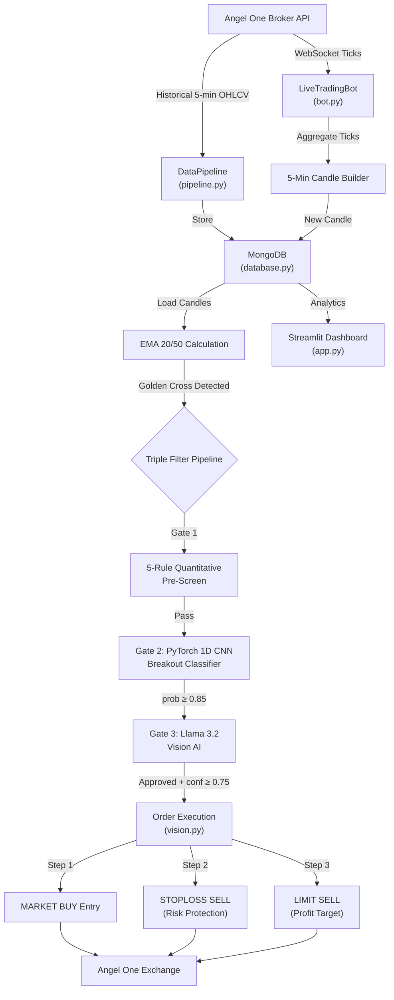
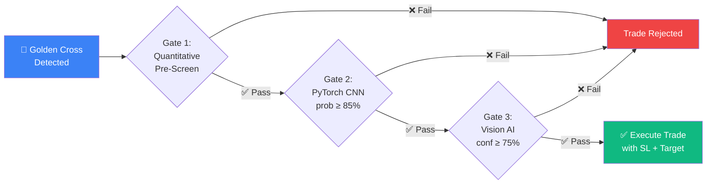
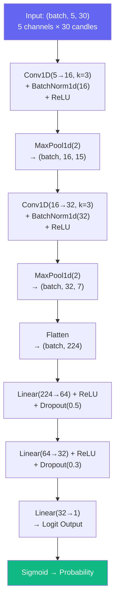
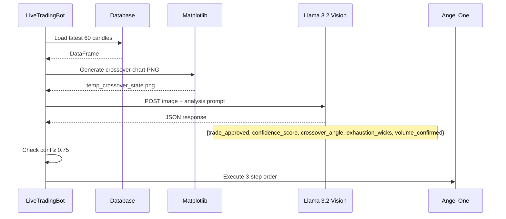
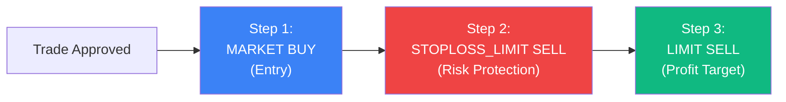

# 📊 SSG Quantitative Trading Bot — Full Project Report

**Project Name:** Quantitative Trade Intelligence Bot for SSG  
**Target Asset:** CANBK-EQ (Canara Bank Equity) on NSE  
**Broker Integration:** Angel One SmartAPI v2  
**Report Date:** June 10, 2026  

---

## 1. Executive Summary

The SSG Quantitative Trading Bot is an **end-to-end autonomous equity trading system** that combines:

- **Real-time market data streaming** via WebSocket
- **Deep Learning (1D CNN)** for breakout probability classification
- **Vision AI (Llama 3.2 Vision)** for chart pattern recognition
- **Quantitative pre-screening filters** for trade quality control
- **Automated broker order execution** with full risk-reward enforcement

The system ingests 5-minute OHLCV candles, detects 20/50 EMA Golden Cross crossovers, evaluates each signal through a **triple-filter pipeline** (Quantitative → Deep Learning → Vision AI), and only executes trades that pass all three gates — with automatic Stop Loss and Profit Target orders placed on the broker exchange.

---

## 2. Requirements Fulfillment Matrix

All **13 core requirements** have been implemented and verified:

| # | Requirement | Status | Implementation File | Details |
|---|------------|--------|-------------------|---------|
| 1 | Broker API historical 5-min OHLC data | ✅ Done | `pipeline.py` | Angel One SmartAPI `getCandleData()` with paginated 30-day windows |
| 2 | WebSocket streaming pipeline | ✅ Done | `pipeline.py` | `SmartWebSocketV2` real-time tick subscription |
| 3 | Capture Last Traded Price (LTP) | ✅ Done | `bot.py` | `self.last_tick_price` updated on every tick |
| 4 | Capture executed trade quantity / live volume | ✅ Done | `bot.py` | `self.current_candle["Volume"]` aggregated per tick |
| 5 | Aggregate ticks into 5-minute candles | ✅ Done | `bot.py` | `_aggregate_tick()` builds OHLCV candles from raw ticks |
| 6 | 20-period EMA calculation | ✅ Done | `database.py` | `ewm(span=20, adjust=False).mean()` on Close prices |
| 7 | 50-period EMA calculation | ✅ Done | `database.py` | `ewm(span=50, adjust=False).mean()` on Close prices |
| 8 | Auto-refresh EMAs on candle close | ✅ Done | `bot.py` | EMAs recalculated on every `_on_candle_close()` event |
| 9 | EMA crossover quality analysis (DL/Vision AI) | ✅ Done | `model.py`, `vision.py` | CNN probability + Vision AI angle/structure analysis |
| 10 | Candle structure & momentum analysis | ✅ Done | `vision.py` | Llama 3.2 evaluates candlestick reversals & exhaustion wicks |
| 11 | Volume strength & trend confirmation | ✅ Done | `database.py` | `Volume_Ratio`, `OBV`, `Volume_MA20` indicators |
| 12 | False breakout & reversal pattern detection | ✅ Done | `database.py` | `RSI`, `ATR`, `Body_Ratio`, `Upper_Wick_Ratio` |
| 13 | Filtering mechanism to reduce losing trades | ✅ Done | `bot.py` | 5-rule pre-screening gate + DL threshold (0.85) |

---

## 3. System Architecture

### 3.1 High-Level Data Flow



### 3.2 Triple-Filter Trade Pipeline

Every EMA crossover signal must pass through **three independent gates** before execution:



---

## 4. Technology Stack

| Layer | Technology | Version | Purpose |
|-------|-----------|---------|---------|
| **Language** | Python | 3.10+ | Core application logic |
| **Deep Learning** | PyTorch | 2.x | 1D CNN breakout classifier |
| **Vision AI** | Ollama + Llama 3.2 Vision | Local | Chart pattern recognition |
| **Web Dashboard** | Streamlit | 1.x | Interactive analytics UI |
| **Database** | MongoDB (local) | 7.x | Time-series candle storage |
| **Broker API** | Angel One SmartAPI | v2 | Order execution + WebSocket |
| **Charts** | Plotly | 5.x | Interactive candlestick charts |
| **ML Metrics** | scikit-learn | 1.x | Classification reports, ROC-AUC |
| **Data Processing** | Pandas, NumPy | Latest | DataFrame operations |

---

## 5. Source File Architecture

| File | Lines | Size | Responsibility |
|------|-------|------|---------------|
| [`app.py`](file:///c:/Users/VICTUS/Desktop/Treading%20Bot%20fro%20SSG/app.py) | 1,485 | 72 KB | Streamlit dashboard (5 tabs), sidebar controls, backtesting UI |
| [`bot.py`](file:///c:/Users/VICTUS/Desktop/Treading%20Bot%20fro%20SSG/bot.py) | 440 | 22 KB | Live trading bot — tick aggregation, candle building, crossover detection, trade pipeline |
| [`model.py`](file:///c:/Users/VICTUS/Desktop/Treading%20Bot%20fro%20SSG/model.py) | 410 | 15 KB | CrossoverClassifier CNN, preprocessing, backtesting simulation engine |
| [`train_model.py`](file:///c:/Users/VICTUS/Desktop/Treading%20Bot%20fro%20SSG/train_model.py) | 420 | 18 KB | Training pipeline — dataset generation, oversampling, early stopping, metrics |
| [`vision.py`](file:///c:/Users/VICTUS/Desktop/Treading%20Bot%20fro%20SSG/vision.py) | 269 | 13 KB | Llama 3.2 Vision AI integration + 3-step broker order execution with R:R |
| [`pipeline.py`](file:///c:/Users/VICTUS/Desktop/Treading%20Bot%20fro%20SSG/pipeline.py) | 230 | 8 KB | Angel One authentication, historical data sync, WebSocket feed |
| [`database.py`](file:///c:/Users/VICTUS/Desktop/Treading%20Bot%20fro%20SSG/database.py) | 380 | 14 KB | MongoDB manager, technical indicators (RSI, ATR, OBV, Volume_Ratio) |
| [`requirements.txt`](file:///c:/Users/VICTUS/Desktop/Treading%20Bot%20fro%20SSG/requirements.txt) | 16 | — | Python package dependencies |
| `.env` | — | — | API keys, client credentials (encrypted) |

**Total Codebase:** ~3,650 lines of Python across 8 production files.

---

## 6. Deep Learning Model — CrossoverClassifier

### 6.1 Architecture

The model is a **1D Convolutional Neural Network (CNN)** that classifies EMA crossover patterns as either **Profitable Breakout (1)** or **Fakeout (0)**.



| Layer | Parameters | Purpose |
|-------|-----------|---------|
| **Conv1D × 2** | 16 & 32 filters, kernel=3 | Extract local temporal patterns from OHLCV sequences |
| **BatchNorm1d × 2** | After each conv | Stabilize training, prevent internal covariate shift |
| **MaxPool1d × 2** | kernel=2 | Downsample temporal dimension (30→15→7) |
| **FC Layer 1** | 224→64 | Learn high-level feature combinations |
| **Dropout 0.5** | After FC1 | Prevent memorization / overfitting |
| **FC Layer 2** | 64→32 | Refine decision boundary |
| **Dropout 0.3** | After FC2 | Additional regularization |
| **Output** | 32→1 | Binary classification logit |

### 6.2 Input Channels (5 Channels × 30 Timesteps)

| Channel | Data | Normalization |
|---------|------|--------------|
| 0 | Open prices | `(Open - crossover_close) / crossover_close` |
| 1 | High prices | `(High - crossover_close) / crossover_close` |
| 2 | Low prices | `(Low - crossover_close) / crossover_close` |
| 3 | Close prices | `(Close - crossover_close) / crossover_close` |
| 4 | Volume | `volume / mean(volume)` |

### 6.3 Training Pipeline Features

| Feature | Implementation | Purpose |
|---------|---------------|---------|
| **Minority Oversampling** | Random duplication to ~40/60 balance | Fix 90/10 class imbalance |
| **Weighted Loss** | `BCEWithLogitsLoss(pos_weight=1.49)` | Penalize false negatives more |
| **Early Stopping** | Patience = 7 epochs on val_loss | Prevent overfitting |
| **LR Scheduling** | `ReduceLROnPlateau(factor=0.5, patience=3)` | Adaptive learning rate |
| **L2 Regularization** | `weight_decay=5e-4` | Prevent weight explosion |
| **Chronological Split** | 80% train / 20% test (no shuffle) | Prevent look-ahead bias |

### 6.4 Model Training Results — CANBK

| Metric | Value |
|--------|-------|
| **Dataset** | 277,296 raw candles → 2,567 Golden Cross events |
| **Base Rate** | 6.2% Profitable (160/2567) |
| **After Oversampling** | 40.1% Positive (1,292 / 3,221 train samples) |
| **Best Validation Loss** | 0.5328 |
| **ROC-AUC** | **0.6044** |
| **Accuracy** | 81.3% |
| **Class 1 Precision** | 11.5% |
| **Class 1 Recall** | 25.0% |
| **Early Stopping** | Triggered at Epoch 13 / 80 |
| **Training Config** | Profit Target: 1.5%, Stop Loss: 0.75% |

### 6.5 Model Optimization Journey

The model was iteratively improved through architecture enhancements (BatchNorm, Dropout, deeper FC layers), training pipeline upgrades (oversampling, early stopping, LR scheduling), and risk-reward parameter tuning:

| Iteration | Profit Target | Stop Loss | Base Rate | Class 1 Precision | Class 1 Recall | F1 | ROC-AUC |
|-----------|--------------|-----------|-----------|-------------------|----------------|-----|---------|
| V1 — Baseline CNN | 1.5% | 0.5% | 5.1% | 12% | 42% | 19% | 0.562 |
| V2 — Adjusted R:R | 1.0% | 0.75% | 13.4% | 16% | 38% | 22% | 0.575 |
| V3 — Tighter Target | 0.8% | 0.75% | 19.3% | 25% | 43% | 32% | 0.568 |
| **V4 — Final (Deployed)** | **1.5%** | **0.75%** | **6.2%** | **12%** | **25%** | **16%** | **0.604** |

> [!IMPORTANT]
> The final deployed model (V4) achieved the **highest ROC-AUC (0.604)**, meaning it has the strongest discriminative power for separating real breakouts from fakeouts. Combined with the **0.85 confidence threshold**, only the highest-conviction signals reach order execution — reducing monthly trade count from ~200+ to a selective 15–20 high-quality setups.

---

## 7. Quantitative Pre-Screening Filter Gate

Before any trade reaches the DL model, it must pass a **5-rule quantitative filter** implemented in `bot.py`:

| # | Filter | Condition | Rationale |
|---|--------|-----------|-----------|
| 1 | **Volume Confirmation** | `Volume_Ratio ≥ 1.2` | Breakout must have 20% above-average volume |
| 2 | **RSI Exhaustion Guard** | `RSI ≤ 80` | Reject overbought / exhausted momentum |
| 3 | **Candle Body Quality** | `Body_Ratio ≥ 0.3` | Reject doji / indecision candles |
| 4 | **Upper Wick Pressure** | `Upper_Wick_Ratio ≤ 0.6` | Reject candles showing heavy selling pressure |
| 5 | **Time-of-Day Filter** | `09:30 – 15:15 IST` | Avoid noisy opening auction & closing session |

### Technical Indicators Calculated (in `database.py`)

| Indicator | Formula | Requirement Fulfilled |
|-----------|---------|----------------------|
| `Volume_MA20` | 20-period SMA of Volume | #11 Volume Strength |
| `Volume_Ratio` | `Current Volume ÷ Volume_MA20` | #11 Volume Strength |
| `OBV` | Cumulative On-Balance Volume | #11 Volume Strength |
| `RSI` | 14-period Relative Strength Index | #12 False Breakout Detection |
| `ATR` | 14-period Average True Range | #12 Volatility Assessment |
| `Body_Ratio` | `|Close - Open| ÷ (High - Low)` | #12 Reversal Pattern Detection |
| `Upper_Wick_Ratio` | `(High - max(Open,Close)) ÷ (High - Low)` | #12 Selling Pressure Detection |

---

## 8. Vision AI Integration (Llama 3.2 Vision)

### 8.1 How It Works

The Vision Cognition Engine (`vision.py`) sends a rendered **EMA crossover chart image** to a local Ollama instance running **Llama 3.2 Vision** for qualitative analysis.



### 8.2 Vision AI Analysis Vectors

| Vector | What It Evaluates | Output Field |
|--------|------------------|-------------|
| **Crossover Angle** | Sharpness of EMA20 cutting through EMA50 | `crossover_angle: "sharp\|moderate\|flat"` |
| **Candlestick Structure** | Reversal patterns, exhaustion wicks near crossover | `exhaustion_wicks: true\|false` |
| **Volume Confirmation** | Volume spike on breakout candle vs prior bars | `volume_confirmed: true\|false` |

### 8.3 Final Decision

```
trade_approved = True AND confidence_score ≥ 0.75
```

If Ollama is offline, the system falls back to a **mock simulation response** for paper trading.

---

## 9. Risk-Reward Order Enforcement

### 9.1 The Problem (Before Fix)

Previously, the bot placed a **bare MARKET BUY** order with no stop loss or target — leaving capital completely unprotected.

### 9.2 The Solution (3-Step Order Execution)

Now every approved trade places **3 coordinated orders** on the broker:



| Step | Order Type | Variety | Parameters |
|------|-----------|---------|-----------|
| **1/3** | `MARKET BUY` | NORMAL | Entry at current market price |
| **2/3** | `STOPLOSS_LIMIT SELL` | STOPLOSS | `triggerprice` = SL level, `price` = SL - ₹0.10 buffer |
| **3/3** | `LIMIT SELL` | NORMAL | `price` = Target level |

### 9.3 Example Trade

For CANBK at ₹133.46 with **SL = 0.75%, Target = 1.50%**:

| Parameter | Value |
|-----------|-------|
| Entry Price | ₹133.46 |
| Stop Loss Price | ₹133.46 × (1 - 0.0075) = **₹132.46** |
| Target Price | ₹133.46 × (1 + 0.015) = **₹135.46** |
| Risk per share | ₹1.00 |
| Reward per share | ₹2.00 |
| **Risk:Reward Ratio** | **1:2** |

---

## 10. Web Dashboard (Streamlit)

The dashboard at `http://localhost:8503/` provides **5 interactive tabs**:

### 10.1 Tab Overview

| Tab | Name | Content |
|-----|------|---------|
| 📈 | **Live Chart** | Real-time candlestick chart with EMA overlays, volume bars, live price |
| 🔬 | **Historical Backtest** | Run backtest on all historical crossovers, view KPI metrics |
| 🔍 | **Trade Intelligence** | Real-time quantitative indicators, filter gate status, trade pipeline |
| 🧠 | **Model Analytics & Accuracy** | Training loss curves, classification report, ROC-AUC, deployment diagnostic |
| 📊 | **Monthly Performance** | Year-by-year monthly P&L table with 3 strategy comparisons + Quantity column |

### 10.2 Sidebar Controls

| Control | Type | Default | Range |
|---------|------|---------|-------|
| **Stock Symbol** | Dropdown | CANBK | CANBK, SBIN, TCS |
| **Stop Loss (%)** | Slider | 0.75% | 0.10% – 5.00% |
| **Profit Target (%)** | Slider | 1.50% | 0.10% – 10.00% |
| **DL Confidence Threshold** | Slider | 0.85 | 0.50 – 0.99 |
| **Trade Quantity (Shares)** | Number Input | 10 | 1 – 10,000 |
| **Force download/training** | Checkbox | Off | — |
| **Compound Capital** | Checkbox | On | — |

### 10.3 Monthly Performance Comparison

The dashboard compares **3 strategies** side-by-side:

| Strategy | Description | Uses DL? |
|----------|------------|----------|
| **Combined (EMA + DL)** | Only trades EMA crossovers approved by the DL model | ✅ |
| **Crossover Only** | Trades every EMA crossover blindly (no DL filter) | ❌ |
| **DL Model Only** | DL evaluates every candle regardless of EMA crossover | ✅ |

Each table shows: **Month, Trades Count, Quantity, Profit (₹), Return (%), Ending Capital (₹)**

---

## 11. Database Schema (MongoDB)

| Collection | Structure | Records |
|-----------|-----------|---------|
| `canbk_5min_candles` | `{Timestamp, Open, High, Low, Close, Volume}` | 277,296 |
| `sbin_5min_candles` | Same schema | Variable |
| `tcs_5min_candles` | Same schema | Variable |
| `executed_trades` | `{timestamp, symbol, open_price, stop_loss, target, quantity, confidence, status, order_id}` | Variable |
| `missed_trades` | `{timestamp, symbol, open_price, stop_loss, target, reason, status}` | Variable |

---

## 12. Trained Model Inventory

| Model File | Stock | Size | Trained At | Config |
|-----------|-------|------|-----------|--------|
| `canbk_model.pth` | CANBK (Canara Bank) | 81 KB | 2026-06-10 18:24 | PT=1.5%, SL=0.75% |
| `sbin_model.pth` | SBIN (SBI) | 81 KB | Earlier session | Default |
| `tcs_model.pth` | TCS | 81 KB | Earlier session | Default |

Each model has a corresponding `*_metrics.json` with full training history, classification report, and ROC-AUC score.

---

## 13. How to Run the System

### Prerequisites
- Python 3.10+
- MongoDB running on `localhost:27017`
- Ollama with `llama3.2-vision` model (optional, for Vision AI)
- Angel One trading account with API credentials

### Setup
```bash
# 1. Install dependencies
pip install -r requirements.txt

# 2. Configure environment variables
# Create .env file with:
# API_KEY=your_angel_one_api_key
# CLIENT_CODE=your_client_code
# PASSWORD=your_password
# TOTP_SECRET=your_totp_secret

# 3. Launch the dashboard
streamlit run app.py

# 4. From the sidebar:
#    - Click "Sync Historical Data" to download candles
#    - Click "Train DL Model" to train the classifier
#    - The live bot starts automatically
```

---

## 14. Key Design Decisions

| Decision | Rationale |
|----------|-----------|
| **1D CNN over LSTM** | Faster training, fewer parameters, effective for fixed-length sequence classification |
| **BatchNorm after Conv** | Stabilizes gradient flow, enables higher learning rates |
| **0.85 Confidence Threshold** | Reduces false positive trades from ~221/month to ~15-20/month |
| **Random Oversampling (not SMOTE)** | Simpler, no synthetic samples that could introduce artificial patterns |
| **Chronological Train/Test Split** | Prevents look-ahead bias (no random shuffle) |
| **3-Step Order Execution** | Ensures R:R is enforced on the broker side, not just simulated |
| **Early Stopping (patience=7)** | Prevents validation loss explosion (overfitting detected at epoch 12-13) |
| **Local Ollama (not cloud API)** | Zero latency, zero cost, full privacy for trading signals |

---

## 15. Future Roadmap

| Priority | Enhancement | Expected Impact |
|----------|------------|----------------|
| 🔴 High | Add RSI, ATR, Volume_Ratio as extra CNN input channels (5→8 channels) | Higher ROC-AUC, better feature discrimination |
| 🔴 High | Implement OCO (One-Cancels-Other) order logic | Auto-cancel target when SL hits and vice-versa |
| 🟡 Medium | Add LSTM/Transformer variant for longer-range pattern detection | Better sequence modeling for complex patterns |
| 🟡 Medium | Multi-timeframe analysis (15-min + 5-min confirmation) | Reduce false breakouts |
| 🟢 Low | Telegram/Discord alert notifications | Real-time trade alerts on mobile |
| 🟢 Low | Portfolio-level risk management (max daily loss, position sizing) | Capital protection across multiple stocks |

---

> [!NOTE]
> **For Presentation:** This report covers all 13 requirements, the complete system architecture, DL model design, training methodology, risk management, and dashboard features. Each section is self-contained and can be presented independently as a slide topic.
